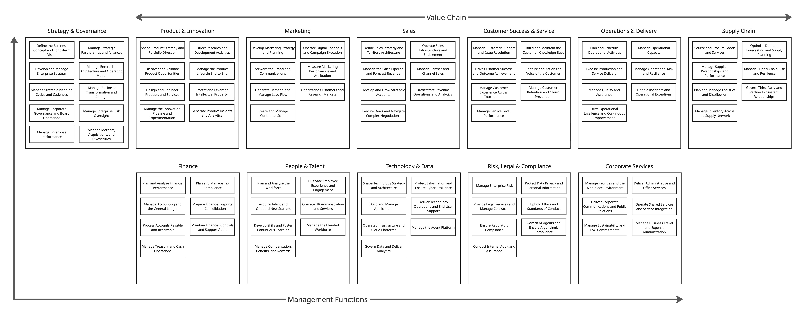

# ZORBA — Zontally Reference Business Architecture

**The open reference architecture for the agentic enterprise.**

ZORBA defines how organisations operate when humans and AI agents work as one — from corporate structure to individual units of work, with agents as first-class workforce participants at every level.

> *Zorba* — from Greek, meaning "to live each day with passion."

## What's Inside

### Framework Documents

| Document | Description |
|----------|-------------|
| [Manifesto](framework/01-manifesto.md) | Why enterprise architecture must be redesigned for the agentic era |
| [Architecture](framework/02-architecture.md) | The structural hierarchy: OU → Domain → Capability → Process → Activity → Work |
| [Workforce Model](framework/03-workforce-model.md) | How humans and AI agents collaborate — agent types, trust levels, autonomy |
| [Domain Reference](framework/04-domain-reference.md) | 12 enterprise domains with Value Chain / Management Function classification |
| [Agentic Patterns](framework/05-agentic-patterns.md) | Reusable patterns for agent participation in enterprise operations |
| [Governance](framework/06-governance.md) | Trust framework for governing a blended human-agent workforce |
| [Information Model](framework/07-information-model.md) | Framework-agnostic meta-model — object types, relationships, composition rules |
| [Industry Editions](framework/08-industry-editions.md) | Vertical-specific configurations: Technology Service Providers, Healthcare, etc. |
| [Evolution Mapping](framework/09-evolution-mapping.md) | Wardley-style evolution tracking for capability and workforce-composition decisions |
| [Industry Taxonomy](framework/10-industry-taxonomy.md) | Machine-readable industry, sub-industry, business model, and operational-signal classification |
| [Usage Guide](framework/11-usage-guide.md) | How to use ZORBA — platform embeds, practitioner forks, YAML → JSON → docs |
| [Contributing](framework/12-contributing.md) | How to report issues, propose changes, and extend Industry Editions |
| [Glossary](framework/13-glossary.md) | Key terms — traditional enterprise architecture + agentic vocabulary |

### Domain Taxonomy

Detailed capability and process definitions for all 12 domains, with ~550 processes each carrying a unique 6-digit ID and agentic profile:

| # | Domain | Classification |
|---|--------|---------------|
| 1 | [Strategy & Governance](domains/01-strategy-and-governance.md) | Management Function |
| 2 | [Product & Innovation](domains/02-product-and-innovation.md) | Value Chain |
| 3 | [Marketing](domains/03-marketing.md) | Value Chain |
| 4 | [Sales](domains/04-sales.md) | Value Chain |
| 5 | [Customer Success & Service](domains/05-customer-success-and-service.md) | Value Chain |
| 6 | [Operations & Delivery](domains/06-operations-and-delivery.md) | Value Chain |
| 7 | [Supply Chain](domains/07-supply-chain.md) | Value Chain |
| 8 | [Finance](domains/08-finance.md) | Management Function |
| 9 | [People & Talent](domains/09-people-and-talent.md) | Management Function |
| 10 | [Technology & Data](domains/10-technology-and-data.md) | Management Function |
| 11 | [Risk, Legal & Compliance](domains/11-risk-legal-and-compliance.md) | Management Function |
| 12 | [Corporate Services](domains/12-corporate-services.md) | Management Function |

## Key Concepts

- **Organisational Unit** is the root of the architecture — recursive, flexible, models any corporate structure
- **Strategy is a cross-cutting overlay**, not the top of the hierarchy — it connects to structural layers at any level
- **Workforce composition** (human vs. agent) is an explicit architectural decision at every layer
- **Framework-agnostic** information model — supports ZORBA, APQC/PCF, or custom taxonomies
- **Industry Editions** tailor the framework for specific verticals
- **Machine-readable by design** — agents can traverse the architecture at runtime

## Published By

ZORBA is published by [Zontally](https://www.zontally.com) as an open reference architecture.

While ZORBA can be adopted independently, it also serves as the foundational model within the Zontally strategy-to-execution platform.

## Licence

ZORBA is licensed under [Creative Commons Attribution-ShareAlike 4.0 International](https://creativecommons.org/licenses/by-sa/4.0/). You are free to use, share, and adapt it — including commercially — with attribution to Zontally. Derivative works must be shared under the same licence.

## Version

See [CHANGELOG.md](CHANGELOG.md) for release history.
