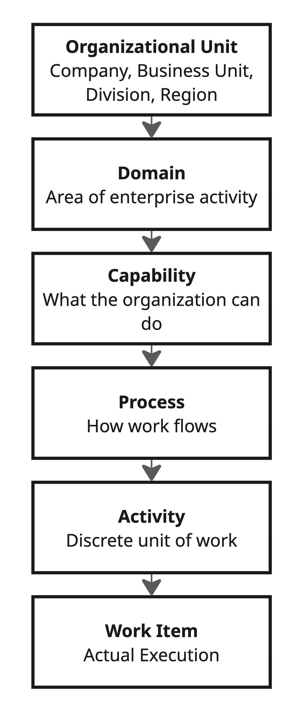
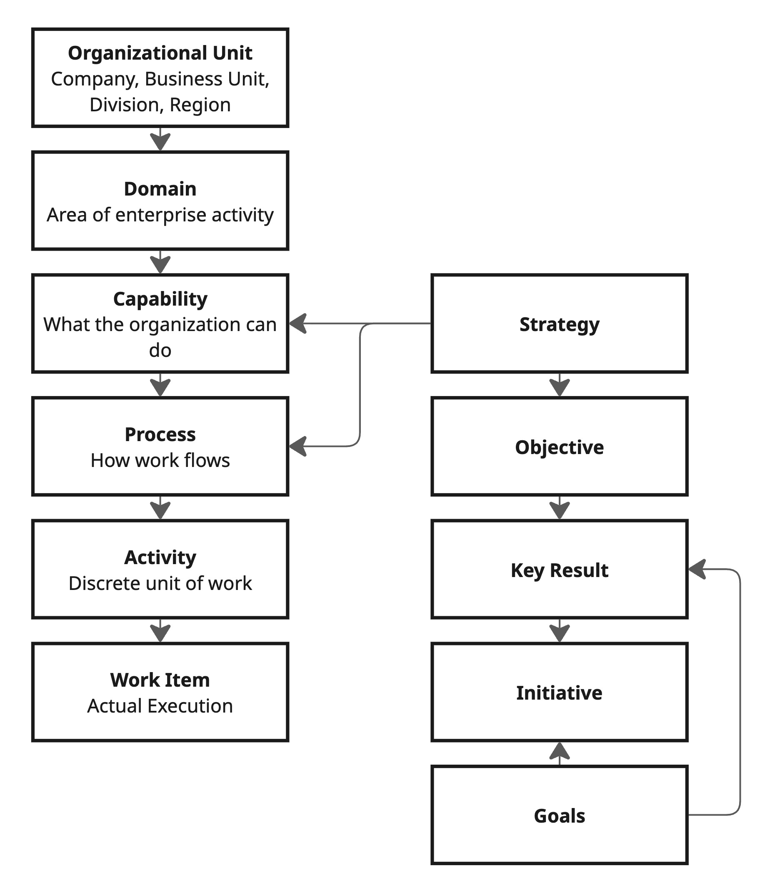

# Framework Architecture

**Zontally Reference Business Architecture**
**Version:** v0.2 (Draft)

---

## Overview

ZORBA's framework architecture consists of two complementary models:

1. **The Structural Hierarchy** — a containment model that describes how enterprises are organised, from corporate structure down to individual units of work.
2. **The Strategic Alignment Overlay** — a cross-cutting model that connects strategic intent to the structural hierarchy through relationships, not containment.

What distinguishes ZORBA from traditional reference architectures is that **every structural layer explicitly defines the roles of humans and agents, their collaboration model, and the governance that applies**.

### The Structural Hierarchy

{height="200"}

### The Strategic Alignment Overlay

Strategy does not sit "above" the structural hierarchy — it sits **alongside** it, connecting to structural objects through alignment relationships:

{height="200"}

A group strategy lives at the OU level. A supply chain strategy lives within the Supply Chain domain. Objectives cascade from strategies and attach to capabilities and processes. This means any work item can be traced back to strategic intent through *two independent paths*:

- **Structural:** Work → Activity → Process → Capability → Domain → OU
- **Strategic:** Work → Initiative → Objective → Strategy

Both paths converge on the same architecture.

### Why This Matters

Traditional frameworks like APQC's PCF define **Category → Process Group → Process** — a clean structural hierarchy but one that doesn't model corporate structure, strategic alignment, or workforce composition. ZORBA's **OU → Domain → Capability → Process → Activity → Work** extends this with:

- **Organisational Units** at the root, enabling complex corporate structures
- **Domains** that carry Value Chain / Management Function classification
- **Workforce composition** defined at every layer
- **Strategic alignment** as a cross-cutting overlay rather than a rigid top-down cascade

---

## Structural Layer: Organisational Unit

**What it defines:** The corporate structure of the enterprise — holding companies, subsidiaries, business units, brands, divisions, regions, departments.

The Organisational Unit is the **root of the ZORBA architecture**. Every other object in the model is ultimately scoped to one or more OUs. OUs nest recursively to any depth, modelling everything from a 50-person single-entity company to a multinational conglomerate.

Each OU may adopt a different [Industry Edition](08-industry-editions.md), meaning a healthcare business unit and a technology services business unit within the same holding company can operate with radically different domain configurations.

See the [Information Model](07-information-model.md) for the full OU object definition, attributes, and relationship types.

### Key Principle

The Organisational Unit answers the question **"who are we?"** before the architecture asks **"what do we do?"** You cannot describe enterprise operations without first describing the enterprise itself.

---

## Structural Layer: Domain

**What it defines:** The major areas of enterprise activity within an Organisational Unit. In ZORBA, these are the [12 reference domains](04-domain-reference.md); in APQC/PCF, they map to categories; in a custom framework, they map to whatever top-level grouping the organisation uses.

### Classification

Domains are classified as either:

- **Value Chain** — activities that directly create, deliver, and capture value. These vary significantly across industries and are where [Industry Editions](08-industry-editions.md) primarily diverge.
- **Management Function** — activities that enable, govern, and support the value chain. These are largely industry-agnostic.

See [04-domain-reference.md](04-domain-reference.md) for the full domain inventory with subtitles and agentic maturity profiles.

### Workforce Composition

Each domain carries an overall workforce composition outlook — from domains that are already highly agent-automated (Supply Chain, Finance) to those that remain human-dominant (Strategy & Governance, People & Talent). This composition is not prescriptive; it describes the direction of travel and helps organisations make deliberate design decisions.

### Key Principle

Domains answer the question **"what areas of activity does this part of the enterprise engage in?"** They are the organisational lens through which capabilities, processes, and work are understood.

---

## Structural Layer: Capability

**What it defines:** The organisational abilities required to operate a domain — what the enterprise needs to be able to do, independent of how it does it.

### Workforce Composition: Blended Design

This is the layer where the human/agent boundary becomes a **primary design decision**. Capability design must now explicitly answer: is this capability delivered by humans, agents, or a blend? What is the target workforce composition?

| Dimension | Description |
|-----------|-------------|
| **Human role** | Define capability requirements, make build/buy/partner decisions, set quality standards, own capability maturity |
| **Agent role** | Capability gap analysis, maturity assessment, cross-domain capability mapping, identifying automation opportunities, maintaining capability registries |
| **Collaboration model** | **Agent-as-architect.** Agents maintain the living map of organisational capabilities, including which are human-delivered, agent-delivered, or blended. Humans make investment and design decisions. |
| **Governance** | Capability definitions require human approval. The designation of a capability as "agent-deliverable" requires explicit governance review including risk assessment, fallback planning, and human override specification. |

### Capability Composition Matrix

At this layer, each capability should be assessed on the ZORBA Capability Composition Matrix:

| Factor | Assessment |
|--------|------------|
| **Cognitive complexity** | Does this require reasoning that agents can reliably perform? |
| **Judgement sensitivity** | Are the consequences of error high enough to require human judgement? |
| **Data availability** | Is sufficient structured data available for agent operation? |
| **Regulatory requirement** | Do regulations require human involvement or decision-making? |
| **Velocity requirement** | Does the speed requirement exceed human capacity? |
| **Creativity requirement** | Does this require genuinely novel thinking vs. pattern application? |

### Key Principle

Capabilities are **workforce-agnostic in definition but workforce-specific in design**. The capability "Process Customer Refunds" exists regardless of who performs it — but the architectural decision of whether it's human-delivered, agent-delivered, or blended is made explicitly at this layer.

---

## Structural Layer: Process

**What it defines:** The structured sequences of activities that deliver capabilities — the "how" of the enterprise.

### Workforce Composition: Blended Orchestration

Processes are where humans and agents most visibly co-exist. A single process may involve human decision points, autonomous agent execution, handoffs between humans and agents, and parallel work streams of mixed composition.

| Dimension | Description |
|-----------|-------------|
| **Human role** | Design process flows, make exception decisions, handle escalations, perform judgement-intensive steps, validate critical outputs |
| **Agent role** | Process orchestration, routing, status tracking, SLA monitoring, automated steps, data transformation, integration, parallel execution of routine branches |
| **Collaboration model** | **Agent-as-orchestrator.** In many processes, agents manage the flow while humans contribute at defined decision points. In others, humans lead and agents execute supporting steps. The collaboration model is process-specific. |
| **Governance** | Every process must have a defined **handoff protocol** for human↔agent transitions. Decision points must be classified by authority level. Agent-executed steps must produce audit-grade logs. Exception handling must define escalation paths. |

### Process Notation

ZORBA extends standard process notation with workforce composition markers:

- **[H]** — Human-executed step
- **[A]** — Agent-executed step
- **[H→A]** — Human-to-agent handoff
- **[A→H]** — Agent-to-human escalation
- **[H+A]** — Collaborative step (human and agent working together)
- **[A⟲]** — Agent autonomous loop (repeating without human intervention)

**Example: Customer Complaint Resolution**

```
[A]   Receive and classify complaint
[A]   Retrieve customer history and context
[A⟲]  Attempt automated resolution (tier 1)
[A→H] Escalate if resolution confidence < threshold
[H+A] Human reviews with agent-prepared brief
[H]   Decision on resolution approach
[A]   Execute resolution actions
[A]   Follow-up and satisfaction monitoring
```

### Key Principle

Process design in the agentic era is fundamentally about **orchestrating a blended workforce**. Every process is a choreography of human and agent actions, and the quality of that choreography determines operational effectiveness.

---

## Structural Layer: Activity

**What it defines:** The discrete, bounded units of work within processes — individual tasks with defined inputs, outputs, and performers.

### Workforce Composition: Agent-Heavy Execution

Activities are where agents deliver the most direct value. Many enterprise activities — data entry, validation, transformation, monitoring, reporting, routing, scheduling — are naturally suited to agent execution.

| Dimension | Description |
|-----------|-------------|
| **Human role** | Complex judgement activities, creative work, relationship-dependent interactions, novel situations, ethical decisions |
| **Agent role** | Routine execution, data processing, pattern-based decisions, monitoring, alerting, document generation, quality checks, scheduling, integration tasks |
| **Collaboration model** | **Agent-as-executor.** At this layer, agents perform the majority of defined activities autonomously, with humans handling exceptions and judgement-intensive activities. |
| **Governance** | Each activity has a defined **autonomy level** (see [Workforce Model](03-workforce-model.md)). Agent-executed activities must meet defined quality thresholds. Activities above a certain risk level require human verification of agent output before proceeding. |

### Activity Classification

Every activity in ZORBA is classified along two axes:

**Performer axis:**
- **Human-only** — Requires capabilities that agents cannot reliably provide
- **Agent-capable** — Can be performed by agents under defined conditions
- **Agent-preferred** — More effectively performed by agents (speed, consistency, scale)
- **Agent-only** — Requires capabilities that exceed human capacity (speed, data volume, parallelism)

**Autonomy axis:**
- **Supervised** — Agent executes, human reviews output before it proceeds
- **Monitored** — Agent executes autonomously, human reviews periodically or by exception
- **Autonomous** — Agent executes without human review under normal conditions
- **Delegated** — Agent has full authority including exception handling within defined bounds

### Key Principle

Activities are the **atomic unit of workforce composition**. The decision of who (or what) performs each activity — and at what level of autonomy — is the most granular and impactful workforce design decision in the enterprise.

---

## Structural Layer: Work

**What it defines:** The actual execution — instances of activities being performed, producing outputs, consuming resources, generating data.

### Workforce Composition: Agent-Dominant Delivery

At the work layer, agents dominate by volume. The vast majority of discrete work instances in a modern enterprise — transactions processed, documents generated, data validated, messages routed, reports compiled — are or will be agent-executed.

| Dimension | Description |
|-----------|-------------|
| **Human role** | Perform assigned work items, exercise judgement on escalated items, provide feedback on agent outputs, handle novel situations |
| **Agent role** | Execute work items at scale, maintain quality and consistency, generate execution data, self-monitor performance, flag anomalies |
| **Collaboration model** | **Agent-as-workforce.** At this layer, the agent IS the primary workforce for most work types. Humans participate in exception handling, quality oversight, and work that requires uniquely human capabilities. |
| **Governance** | Continuous quality monitoring. Statistical process control applied to agent-executed work. Human sampling for quality assurance. Full traceability from work instance back through activity, process, capability, domain, to OU — and through initiative, objective, to strategy. |

### Work Instance Metadata

Every work instance in ZORBA carries metadata that enables governance and traceability:

| Field | Description |
|-------|-------------|
| `performer_type` | Human, agent, or collaborative |
| `performer_id` | Identifier of the specific human or agent instance |
| `autonomy_level` | The autonomy level at which this work was performed |
| `confidence` | Agent's self-assessed confidence (agent-executed work only) |
| `review_status` | Unreviewed, human-reviewed, agent-reviewed, auto-approved |
| `escalation_chain` | If escalated, the sequence of handoffs |
| `structural_lineage` | OU → Domain → Capability → Process → Activity → Work |
| `strategic_lineage` | Strategy → Objective → Initiative → Work |

### Key Principle

Work is where architecture meets reality. Every work instance is **evidence** of how the blended workforce actually operates — and the data generated at this layer feeds back into every layer above it.

---

## Strategic Alignment Overlay

Strategy, Objectives, and Initiatives are not structural containers — they are **alignment objects** that connect to the structural hierarchy through typed relationships.

### Strategy

Strategies exist at multiple levels of the architecture:

| Scope | Example | Scoped To |
|-------|---------|-----------|
| **Enterprise** | "ACME Corp Group Strategy 2026–2030" | Top-level OU |
| **Business Unit** | "ACME Health Growth Strategy" | Business Unit OU |
| **Domain** | "Marketing Strategy 2026" | Domain within an OU |
| **Capability** | "Customer Self-Service Automation Strategy" | Specific capability |
| **Process** | "Product Marketing Strategy" | Specific process or process group |

Strategies at different levels naturally interlink — a Product Marketing Strategy connects upward to the Marketing Strategy which connects to the Business Unit strategy. This creates a **strategy hierarchy that mirrors but does not duplicate the structural hierarchy**. The architecture does not prescribe where strategies must exist; it permits them at any level where strategic intent needs to be articulated.

Strategy formulation is **human-dominant** — it is fundamentally about judgement, values, ambition, and risk appetite. Agents play a critical supporting role in environmental scanning, competitive intelligence, scenario modelling, and strategy document generation, but strategic decisions require human authority.

### Objectives

Objectives cascade from strategies and attach to structural objects:

- An OKR might align to a capability: *"Reduce customer complaint resolution time by 40%"* → attached to the Customer Support capability
- A KPI might measure a process: *"First-contact resolution rate > 85%"* → attached to the Complaint Resolution process
- A strategic goal might span a domain: *"Achieve 60% agent workforce composition in Operations"* → attached to the Operations & Delivery domain

Objective-setting is **human-led, agent-informed**. Agents analyse historical performance, recommend targets, track progress, and alert on deviation — but humans set the targets and own accountability.

### Initiatives

Initiatives bridge objectives to work. They are bounded efforts (programmes, projects, workstreams) that produce work items contributing to objectives. Initiatives may span multiple domains and capabilities.

### Traversal

An agent (or human) can trace any work item back to strategic intent through two paths:

```
STRUCTURAL PATH:
Work Item → Activity → Process → Capability → Domain → OU
"What part of the organisation produced this work?"

STRATEGIC PATH:
Work Item → Initiative → Objective → Strategy
"What strategic intent drove this work?"
```

Both paths converge on the same architecture. This dual traversal is what makes ZORBA's architecture machine-readable and strategically traceable.

---

## Cross-Layer Dynamics

### The Governance Gradient

Governance intensity varies across the structural hierarchy, reflecting different risk profiles:

| Structural Layer | Governance Intensity | Primary Concern |
|------------------|---------------------|-----------------|
| Organisational Unit | Corporate governance, board-level | Legal structure, regulatory compliance |
| Domain | Strategic oversight | Domain strategy, investment priority |
| Capability | High — explicit workforce composition decisions | Build/automate decisions, risk assessment |
| Process | Medium — defined handoff and escalation protocols | Orchestration quality, exception handling |
| Activity | Varies by classification — risk-proportionate | Execution quality, autonomy appropriateness |
| Work | Continuous monitoring — statistical and exception-based | Output quality, anomaly detection |

### The Feedback Loop

ZORBA is not a top-down cascade. Data flows upward as well as downward:

- **Work data** reveals actual agent performance, informing Activity classification
- **Activity metrics** expose process bottlenecks and workforce composition effectiveness
- **Process performance** validates or challenges Capability design decisions
- **Capability assessments** inform Domain strategy and investment
- **Domain performance** feeds Organisational Unit governance and strategic review

In an agent-rich enterprise, this feedback loop operates **continuously and automatically** — agents monitoring their own performance across layers and surfacing insights that would take human analysts weeks to compile.

### Architecture as Operating System

In a traditional enterprise, architecture is a reference document. In a ZORBA-enabled enterprise, architecture is closer to an **operating system** — a machine-readable, agent-interpretable structure that agents use to understand their own context, authority, and boundaries.

This is not metaphor. When an agent needs to determine whether it has authority to approve a purchase, it should be able to query the architecture: What domain is this? What process am I in? What activity am I performing? What is my autonomy level? What are my escalation paths? The architecture becomes the runtime governance layer.

---

*Previous: [← The ZORBA Manifesto](01-manifesto.md) | Next: [The Blended Workforce Model →](03-workforce-model.md)*

---

*© 2026 Zontally. All rights reserved.*
